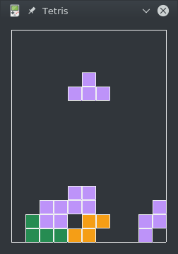

# Tetris

**Сult game of all generations**

> "I invented tetris for my own pleasure. This is the only way to invent something."
>
> *Alexey Pazhitnov*




## Table of contents

- [Description](#Description)
    
- [Installation](#Installation)

    1. Installing SDL2 libraries:

        - [Windows](#SDL2W)
        - [Linux](#SDL2L)

    2. Installing Cmake 

        * Windows : <https://cmake.org/download/>
        * Linux :
        ```bash
            apt install cmake
        ```

    3. [Compile](#Compile) source code.
        
    
- [Notes](#Notes)

## <a name="Description"></a> Description

## <a name="Installation"></a> Installation

### <a name="SDL2W"></a> Installing SDL2 libs on windows

* x64 : 
    * [SDL2-2.0.10-win32-x64.zip](https://www.libsdl.org/release/SDL2-2.0.10-win32-x64.zip)
    * [SDL2_image-2.0.5-win32-x64.zip](https://www.libsdl.org/projects/SDL_image/release/SDL2_image-2.0.5-win32-x64.zip)
    * [SDL2_ttf-2.0.15-win32-x64.zip](https://www.libsdl.org/projects/SDL_ttf/release/SDL2_ttf-2.0.15-win32-x64.zip)
    * [SDL_mixer-1.2.12-win32-x64.zip](https://www.libsdl.org/projects/SDL_mixer/release/SDL_mixer-1.2.12-win32-x64.zip)

* x32 : 
    * [SDL2-2.0.10-win32-x86.zip](https://www.libsdl.org/release/SDL2-2.0.10-win32-x86.zip)
    * [SDL2_image-2.0.5-win32-x86.zip](https://www.libsdl.org/projects/SDL_image/release/SDL2_image-2.0.5-win32-x86.zip)
    * [SDL2_ttf-2.0.15-win32-x86.zip](https://www.libsdl.org/projects/SDL_ttf/release/SDL2_ttf-2.0.15-win32-x86.zip)
    * [SDL_mixer-1.2.12-win32.zip](https://www.libsdl.org/projects/SDL_mixer/release/SDL_mixer-1.2.12-win32.zip)

### <a name="SDL2L"></a> Installing SDL2 libs on linux

* Ubuntu and Debian 
    ```bash
        apt install libsdl2-dev libsdl2-image-dev libsdl2-ttf-dev libsdl2-mixer-dev
    ```
* Fedora and CentOS
    ```bash
        yum install SDL2-devel SDL_image-devel SDL_ttf-devel SDL_mixer-devel
    ```
    
### <a name="Compile"></a> Compile

```bash
    cd /DownloadPath/Tetris
    mkdir build
    cd build
    cmake ..
    make
```

## <a name="Notes"></a> Notes

**Keyboard controls**

Action|Key  |Alternative
------|-----|-----------
left  |a    |ARROW LEFT
right |d    |ARROW RIGHT
drop  |SPACE|-
rotate|w    |ARROW UP
