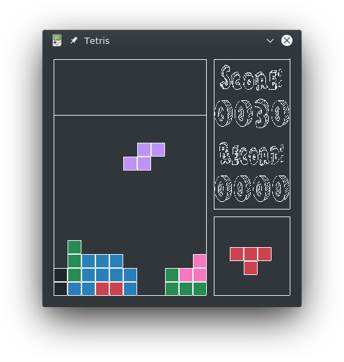

# Tetris

**Сult game of all generations**

> "I invented tetris for my own pleasure. This is the only way to invent something."
>
> *Alexey Pazhitnov*



## Table of contents

- [Description](#Description)

- [Installation](#Installation)

    1). Installing SDL2 libraries:

        - [Windows](#SDL2W)
        - [Linux](#SDL2L)

    2). Installing Cmake 

        * Windows : <https://cmake.org/download/>
        * Linux :
        ```bash
            apt install cmake
        ```

    3). [Compile](#Compile) source code.
        
    
- [Notes](#Notes)
___

## <a name="Description"></a> Description

### Standard game

Standard game is a well-known tetris with standard features and mechanics (Details below).

### Modificated game

Modification, besides ***colored blocks*** under modifier,

- `STANDART` : No comments,

brings ***black blocks*** that are separated by modifiers and randomly accept one of the above conditions.:

- `BLOWUP` : Explodes (cleans) blocks in a radius of touchdown,
- `FAKE` : Disappears, as if he was not there,
- `INVERSED` : Make a stroke of their shape, as at the crime scene,
- `FLUID` : May lose its shape upon landing and clog the gaps in your tetris, if you "pour" it correctly.
___

## <a name="Installation"></a> Installation

### <a name="SDL2W"></a> Installing SDL2 libs on windows

* x64 : 
    * [SDL2-2.0.10-win32-x64.zip](https://www.libsdl.org/release/SDL2-2.0.10-win32-x64.zip)
    * [SDL2_image-2.0.5-win32-x64.zip](https://www.libsdl.org/projects/SDL_image/release/SDL2_image-2.0.5-win32-x64.zip)
    * [SDL2_ttf-2.0.15-win32-x64.zip](https://www.libsdl.org/projects/SDL_ttf/release/SDL2_ttf-2.0.15-win32-x64.zip)
    * [SDL_mixer-1.2.12-win32-x64.zip](https://www.libsdl.org/projects/SDL_mixer/release/SDL_mixer-1.2.12-win32-x64.zip)

* x32 : 
    * [SDL2-2.0.10-win32-x86.zip](https://www.libsdl.org/release/SDL2-2.0.10-win32-x86.zip)
    * [SDL2_image-2.0.5-win32-x86.zip](https://www.libsdl.org/projects/SDL_image/release/SDL2_image-2.0.5-win32-x86.zip)
    * [SDL2_ttf-2.0.15-win32-x86.zip](https://www.libsdl.org/projects/SDL_ttf/release/SDL2_ttf-2.0.15-win32-x86.zip)
    * [SDL_mixer-1.2.12-win32.zip](https://www.libsdl.org/projects/SDL_mixer/release/SDL_mixer-1.2.12-win32.zip)
___

### <a name="SDL2L"></a> Installing SDL2 libs on linux

* Ubuntu and Debian 
    ```bash
        apt install libsdl2-dev libsdl2-image-dev libsdl2-ttf-dev libsdl2-mixer-dev
    ```
* Fedora and CentOS
    ```bash
        yum install SDL2-devel SDL_image-devel SDL_ttf-devel SDL_mixer-devel
    ```
___
    
### <a name="Compile"></a> Compile

```bash
    cd /DownloadPath/Tetris
    mkdir build
    cd build
    cmake ..
    make
```
___

## <a name="Notes"></a> Notes

The number of **points** received depends on the **count** of cleared lines,

Game options can be changed **before** compilation in **CmakeLists.txt**


### Game options

#### General

- **Default game mode** (`ON` / `OFF`) = `DEFAULT_TETRIS_MODE` 

- **Audio** (`ON` / `OFF`) = `AUDIO`

#### Info panel

- **Show** (`ON` / `OFF`) = `INFO`

- **Location** (`ON` / `OFF`) = `INFO_SWAP`
___

### Keyboard controls

Action|Key  |Alternative
------|-----|-----------
left  |a    |ARROW LEFT
right |d    |ARROW RIGHT
drop  |SPACE|-
rotate|w    |ARROW UP

